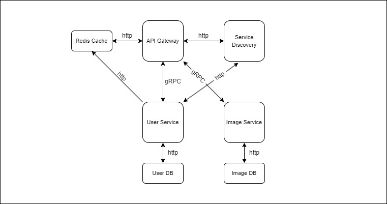

# Laboratory work nr 1

# Web Proxy: Image sharing for novice artists

- Author: Boicu Stefan
- Academic group: FAF203

# Design Document

##  Application Suitability

This application is suitable for the microservices architecture because of several reasons. Among them the most important being scalability, fault tolerance and modularity.

- Scalability: As a platform for user generated data, the number of images hosted on the platform as well as the geographical distribution of the users can increase at a rapid pace. A microservice architecture allows for the platform to scale horizotally much more easily tahn a monolith one, thus meeting possible user demand.

- Fault tolerance: A microservice architecture can be much more resilient than a monolith. Different services have different responsabilities and also run independently. If one service is temporarily unavailable, the platform as a whole might still be functional. Several duplicate services can run in parallel to manage the load better as well as provide fault tolerance in case on of them crushes.

- Modularity: Problems arise as the platform has more and more users and the application will need to evolve and refactor to meet the new requirements. Microservices are modular by nature, which means that new or replacement services can be developed and deployed without the neend to stop or shutdown all the existing ones. New services can be introduced gradually.

**Real examples**

- Pinterest is a known website that uses microservices to manage its millions of users and their posted images.
- Imgur and Deviantart are also image sharing platforms, but they keep their backend architecture undisclosed, so it can only be speculated that they use microservices as well.

## Service Boundaries

- **User service:** The user service handles user registrations, user authentification and user authorisation.
- **Image service:** The image service handles operations related to images. Depending on user authorisation, images can be uploaded and deleted. Images can have an optional name and short description.
- **Feed Service:** The feed service will compile the user's interests and give him an image (or set of images) based on their preferences.
- **API Gateway:** The API Gateway will stand between the (supposed) front end of the website and the other services. It will query service discovery and then forward the requests to the user and image service.
- **Service Discovery:** The service discovery will keep the addresses of all other services in memory and be queried by services which make requests. It will also perform load balancing
- **Cache:** The cache will store user tokens until they expire. It will also cache an image for an hour if it is queried more than twice within 10 minutes.



**Communication**

- The user service and image service will use gRPC for communications and implement message queues.
- The api gateway will use RESTful API to receive requests from users. It will communicate with the user and image services via gRPC.
- The service discovery and cache will communicate via HTTP.

## Technology Stack
- **User service:** Go
  - **User database:** MongoDB
- **Image service:** Go
  - **Image database:** MongoDB
- **API Gateway:** Ruby on Rails.
- **Service Discovery:** Ruby
- **Cache:** Redis db for cache.

## Data Management

### Operations

- Register user
- Login user
- Get image
- Upload image
- Delete image
- Modify image name or description

### User Service

#### Register User

- gRPC request

``

```json
{
  "name":     "Mario",
  "password": "Mario"
}

```

- gRPC response

```json
{
  "message":  "success",
  "error":    "error message"
}

```

On success the message is "success" and the error is an empty string. On failure the message is "failure" and error messages vary.

Errors will be "empty/invalid name and/or password" as well as "existing username"

#### Login User

- gRPC request

```json
{
  "name":     "Mario",
  "password": "Mario"
}

```

- gRPC response

```json
{
  "accessToken":  "abcdnndsnodnsoknfodnsfdsnflsdknfsldkn",
  "refreshToken": "fghsadsladnsknvuoamdoxlacmnndsaiodajj",
  "error":        "error message"
}

```

On successful request the user is returned an access and refresh token. The error message is empty.

On failure the user gets an error message. "Your login or password is not correct"

### Image Service

#### Upload image

- gRPC request

```json
{
  "imageBlob":    "0001010101010101010101010101",
  "author":       "gilgamesh777",
  "title":        "post-post-modern Mona Lisa", // optional
  "description":  "A new reimagining of a classic painting" //optional
}

```

The requests consist of an image blob and optionally a title and a description

- gRPC response

```json
{
  "message":  "success",
  "imageID":  "ffnn990",
  "error":    "error message"
}

```

On success the message is success and the error is empty. On failure the message is failure and the image ID is empty. Error contains error message.

#### Get image

- gRPC request

```json
{
  "imageID": "ffnn990"
}

```

- gRPC response

```json
{
  "imageBlob":    "0001010101010101010101010101",
  "author":       "gilgamesh777",
  "title":        "post-post-modern Mona Lisa", // if present
  "description":  "A new reimagining of a classic painting", // if present
  "error":        "error message"
}

```

In case the image is present in the database, the image blob is returned. If there is no such image the image blob is empty and an error message is returned.

#### Modify image

- gRPC request

```json
{
  "imageID":      "ffnn990",
  "title":        "post-post-modern Mona Lisa", // optional
  "description":  "A new reimagining of a classic painting" // optional
}

```

At least one between the title and the description should be present or it returns an error

- gRPC response

```json
{
  "message":  "success",
  "error":    "error message"
}

```

If the operation is successful, the "success" message is returned, otherwise an error is returned.

#### Delete image

- gRPC request

```json
{
  "imageID":      "ffnn990"
}

```

- gRPC response

```json
{
  "message":  "success",
  "error":    "error message"
}

```

If the operation is successful, the "success" message is returned, otherwise an error is returned.

### API Gateway

The gateway mirrors the endpoints from the image and user service, but it also checks the redis cache to see if the user is authorised to perform the actions it wants to.

#### Register User

- http request
- endpoint: `/signup`
- method: POST

```json
{
  "name":     "Mario",
  "password": "Mario"
}

```

- http response

```json
{
  "message":  "success",
  "error":    "error message"
}

```

On success the message is "success" and the error is an empty string. On failure the message is "failure" and error messages vary.

Errors will be "empty/invalid name and/or password" as well as "existing username"

#### Login User

- http request
- endpoint: `/login`
- method: POST

```json
{
  "name":     "Mario",
  "password": "Mario"
}

```

- http response

```json
{
  "accessToken":  "abcdnndsnodnsoknfodnsfdsnflsdknfsldkn", // as cookie
  "refreshToken": "fghsadsladnsknvuoamdoxlacmnndsaiodajj", // as cookie
  "error":        "error message"
}

```

On successful request the user is returned an access and refresh token. The error message is empty.

On failure the user gets an error message. "Your login or password is not correct"

#### Refresh token

#### Upload image

- http request
- endpoint: `/img`
- method: POST

```json
{
  "accessToken":  "abcdnndsnodnsoknfodnsfdsnflsdknfsldkn",
  "imageBlob":    "0001010101010101010101010101",
  "title":        "post-post-modern Mona Lisa", // optional
  "description":  "A new reimagining of a classic painting" //optional
}

```

- http response

```json
{
  "message":  "success",
  "imageID":  "ffnn990",
  "error":    "error message"
}

```

#### Get image

- http request
- endpoint: `/{imgID}`
- method: GET

```json
{}

```

- http response

```json
{
  "imageBlob":    "0001010101010101010101010101",
  "author":       "gilgamesh777",
  "title":        "post-post-modern Mona Lisa", // if present
  "description":  "A new reimagining of a classic painting", // if present
  "error":        "error message"
}

```

In case the image is present in the database, the image blob is returned. If there is no such image the image blob is empty and an error message is returned.

#### Modify image

- http request
- endpoint: `/{imgID}`
- method: PATCH

```json
{
  "accessToken":  "abcdnndsnodnsoknfodnsfdsnflsdknfsldkn",
  "imageID":      "ffnn990",
  "title":        "post-post-modern Mona Lisa", // optional
  "description":  "A new reimagining of a classic painting" // optional
}

```

At least one between the title and the description should be present or it returns an error

- http response

```json
{
  "message":  "success",
  "error":    "error message"
}

```

If the operation is successful, the "success" message is returned, otherwise an error is returned.

#### Delete image

- http request
- endpoint: `/{imgID}`
- method: DELETE

```json
{
  "accessToken":  "abcdnndsnodnsoknfodnsfdsnflsdknfsldkn",
  "imageID":      "ffnn990"
}

```

- http response

```json
{
  "message":  "success",
  "error":    "error message"
}

```

### Service Discovery

#### Get Service

- http request
- endpoint: `/service`
- method: GET

```json
{
  "serviceName": "USER SERVICE"
}

```

- http response

```json
{
  "host":       "localhost:3799",
  "connTicket": "B17A90JKL"
}

```

The user service is only available on the private network. A service asks for what it wants to acces and the service discovery returns the address and a ticket, while also performing load balancing.

After closing a connection, the respective service should close the connection ticket

#### Close ticket

- http request
- endpoint: `/ticket`
- method: POST

```json
{
  "connTicket": "B17A90JKL"
}

```

- http response

```json
{
  "message":  "success",
  "error":    "error message"
}

```

#### Add service

- http request
- endpoint: `/service`
- method: POST

```json
{
  "serviceName": "USER SERVICE",
  "host": "localhost:3799"
}

```

- http response

```json
{
  "message":  "success",
  "error":    "error message"
}

```

#### Remove service

- http request
- endpoint: `/service`
- method: DELETE

```json
{
  "serviceName": "USER SERVICE",
  "host": "localhost:3799"
}

```

- http response

```json
{
  "message":  "success",
  "error":    "error message"
}

```

This method is used when a service performs a graceful shutdown. If a service crashes the Service Discovery will detect it using the heartbeat algorithm.

## Deployment and Scaling

- **Docker**. All the services will be dockerised for deployment to ensure they behave in a predictable manner.
- **Docker compose**. Scaling will be achieved by using docker compose because of its simplicity.
