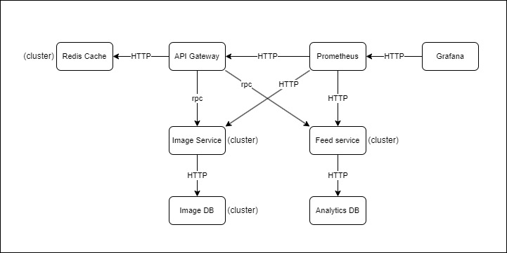

# Laboratory work nr 1

# Web Proxy: Image sharing for novice artists

- Author: Boicu Stefan
- Academic group: FAF203

# Design Document

##  Application Suitability

This application is suitable for the microservices architecture because of several reasons. Among them the most important being scalability, fault tolerance and modularity.

- Scalability: As a platform for user generated data, the number of images hosted on the platform as well as the geographical distribution of the users can increase at a rapid pace. A microservice architecture allows for the platform to scale horizotally much more easily tahn a monolith one, thus meeting possible user demand.

- Fault tolerance: A microservice architecture can be much more resilient than a monolith. Different services have different responsabilities and also run independently. If one service is temporarily unavailable, the platform as a whole might still be functional. Several duplicate services can run in parallel to manage the load better as well as provide fault tolerance in case on of them crushes.

- Modularity: Problems arise as the platform has more and more users and the application will need to evolve and refactor to meet the new requirements. Microservices are modular by nature, which means that new or replacement services can be developed and deployed without the neend to stop or shutdown all the existing ones. New services can be introduced gradually.

**Real examples**

- Pinterest is a known website that uses microservices to manage its millions of users and their posted images.
- Imgur and Deviantart are also image sharing platforms, but they keep their backend architecture undisclosed, so it can only be speculated that they use microservices as well.

## Service Boundaries

- **User service:** The user service handles user registrations, user authentification and user authorisation.
- **Image service:** The image service handles operations related to images. Depending on user authorisation, images can be uploaded and deleted. Images can also be added or removed from galleries. Galleries are simple collections of images. Individual images and galleries can have an optional name and short description. The image service will query the user service if it needs authorization.
- **API Gateway:** The API Gateway will stand between the (supposed) front end of the website and the other services. It will query service discovery and then forward the requests to the user and image service.
- **Service Discovery:** The service discovery will keep the addresses of all other services in memory and be queried by services which make requests. It will also perform load balancing
- **Cache:** The cache will store user tokens until they expire. It will also cache an image for an hour if it is queried more than twice within 10 minutes.

**Communication**

- The user service and image service will use gRPC for communications and implement message queues.
- The api gateway will use RESTful API to receive requests from users. It will communicate with the user and image services via gRPC.
- The service discovery and cache will communicate via HTTP.

## Technology Stack
- **User service:** Go
  - **User database:** PostgreSQL
- **Image service:** Go
  - **Image database:** MongoDB
- **API Gateway:** Ruby on Rails.
- **Service Discovery:** Ruby
- **Cache:** Redis db for cache.

## Data Management

### Operations

- Register user
- Login user
- Get image
- Upload image
- Delete image
- Modify image name or description
- Get gallery
- Create gallery
- Delete gallery
- Modify gallery name or description
- Add image to gallery
- Remove image from gallery
- Add permission to gallery
- Remove permission from gallery

## Deployment and Scaling

- **Docker**. All the services will be dockerised for deployment to ensure they behave in a predictable manner.
- **Docker compose**. Scaling will be achieved by using docker compose because of its simplicity.
